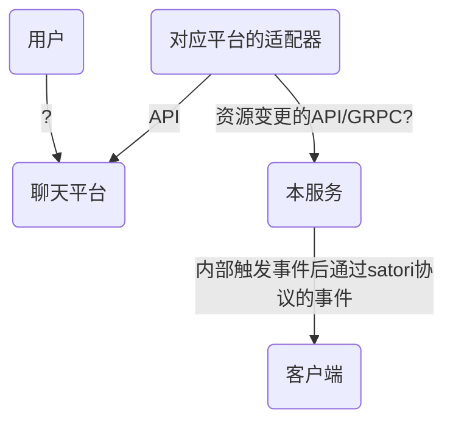
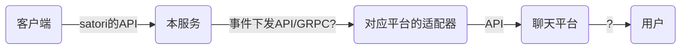

# satori-server-go
基于satori协议机器人的服务端

## 1.设计和架构
### 1.1.流程图
#### 1.1.1.聊天平台行为下发到客户端

```mermaid
graph TD;
    User(用户)--?-->Chat(聊天平台);
    Adaptor(对应平台的适配器)--API-->Chat(聊天平台);
    Adaptor--资源变更的API/GRPC?-->Server(本服务);
    Server--内部触发事件后通过satori协议的事件-->Client(客户端);
```
#### 1.1.2.客户端行为上报聊天平台

```mermaid
graph LR;
    Client(客户端)--satori的API-->Server(本服务);
    Server--事件下发API/GRPC?-->Adaptor(对应平台的适配器);
    Adaptor--API-->Chat(聊天平台);
    Chat--?-->User(用户)
```
