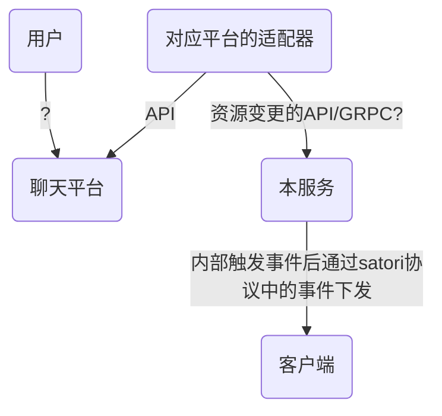
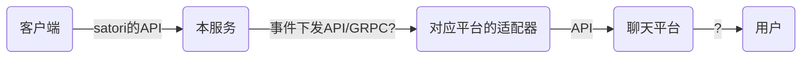

# satori-server-go
基于satori协议机器人的服务端

WIP: 此项目正处于开发中，且作者是个拖延症晚期

## 1.设计和架构
### 1.1.流程图
#### 1.1.1.聊天平台行为下发到客户端

#### 1.1.2.客户端行为上报聊天平台

### 1.2.模块
> **横向**切割的功能模块

模块名|说明|建议
-|-|-
自增序列|提供资源的自增序列|可以使用外部能力实现，不必显示提供（例如数据库自增主键）
http服务|接收和处理资源变更的请求|接收事件后立刻触发事件，将事件交给事件处理
事件管理|用于接收外部事件变更后广播给对应的所有监听者，需要提供监听者注册能力|-
资源管理|存储资源和资源事件|资源本身必须是有序队列，类似feed
插件管理|插件完整生命周期维护，提供与插件的交互能力，另外提供一个go语言的插件builder，加速插件开发|基于[hashicorp/go-plugin](https://github.com/hashicorp/go-plugin)，且需要提供一份脱离语言的文档/模板仓库
资源模型|资源模型的struct，且需要提供grpc和json报文能力|单独建一个仓库
事件渠道|基于一个接口，实现ws/webhook两种渠道|-