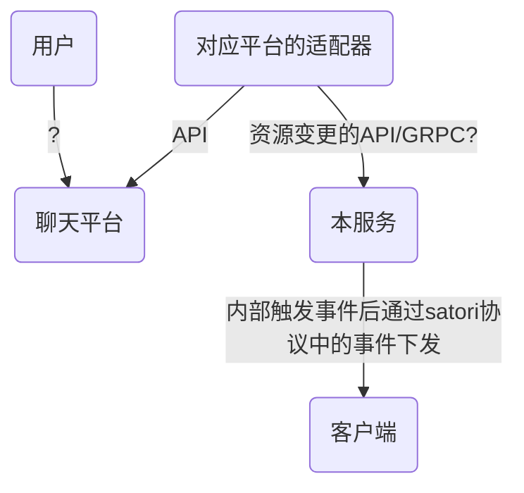
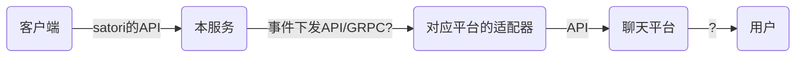

# satori-application-go
基于satori协议机器人的服务端
>  此项目正处于开发中，且作者是个拖延症晚期

[](./LICENSE)
[](https://github.com/dezhishen/satori-application-go/stargazers)
[](https://github.com/dezhishen/satori-application-go/network/members)
[](https://github.com/dezhishen/satori-application-go/graphs/contributors)

[](https://github.com/dezhishen/satori-application-go/graphs/commit-activity)
[](https://github.com/dezhishen/satori-application-go/commits)
[](https://wakatime.com/badge/user/a2c981ca-317d-4b34-8ed9-4264fbfdb775/project/018b429b-32da-436c-9bb1-d665600b5c4c)

## 1.设计和架构
### 1.1.流程图
#### 1.1.1.聊天平台行为下发到客户端


#### 1.1.2.客户端行为上报聊天平台


### 1.2.project-layout
```
- internal # 内部包,基于pkg包的实现
- pkg # 公共包,核心模块和主要逻辑
  - adaptor # 适配器的定义
  - application # 本服务本身是一个应用, 这里是针对这个应用的定义
  - config # 配置的定义
  - plugin # 插件(不是机器人插件,而是插件开发模式中,插件本身,定义插件)
  - satori # satori协议下 适配器和机器人插件 的约束
- main.go #程序启动入口
```

### 1.3.主要功能模块
> **横向**切割的功能模块

模块名|说明|建议
-|-|-
自增序列|提供资源的自增序列|可以使用外部能力实现，不必显示提供（例如数据库自增主键）
http服务|接收和处理资源变更的请求|接收事件后立刻触发事件，将事件交给事件处理
事件管理|用于接收外部事件变更后广播给对应的所有监听者，需要提供监听者注册能力|-
资源管理|存储资源和资源事件|资源本身必须是有序队列，类似feed
插件管理|插件完整生命周期维护，提供与插件的交互能力，另外提供一个go语言的插件builder，加速插件开发|基于[hashicorp/go-plugin](https://github.com/hashicorp/go-plugin)，且需要提供一份脱离语言的文档/模板仓库
资源模型|资源模型的struct，且需要提供grpc和json报文能力|单独建一个仓库[dezhishen/satori-model-go](https://github.com/dezhishen/satori-model-go)
事件渠道|基于一个接口，实现ws/webhook两种渠道|-
